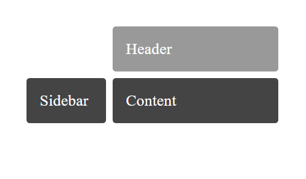
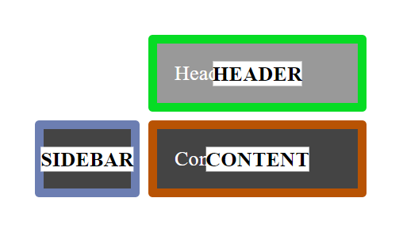
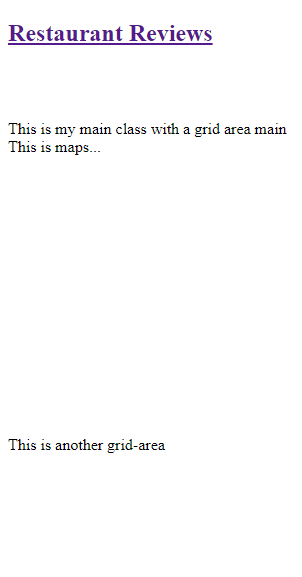
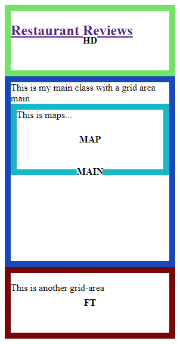

# Visualize-Named-CSS-Grid-Areas

### This little chrome extension visualizes named css grid areas. 

Extension creates a border in a random color for each named grid-area that was found in the body and adds a div in the center of the parent node.

[Example taken from here](https://gridbyexample.com/examples/code/example11.html)
#### Before

#### After

#### Before

#### After
